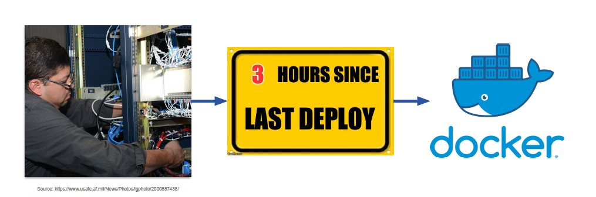
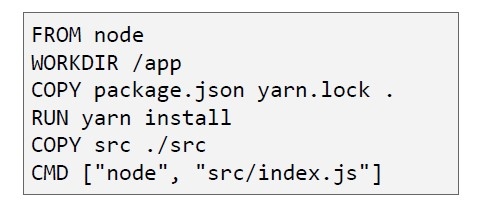
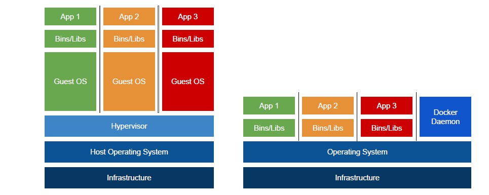
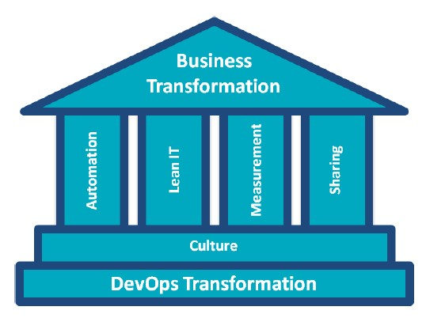
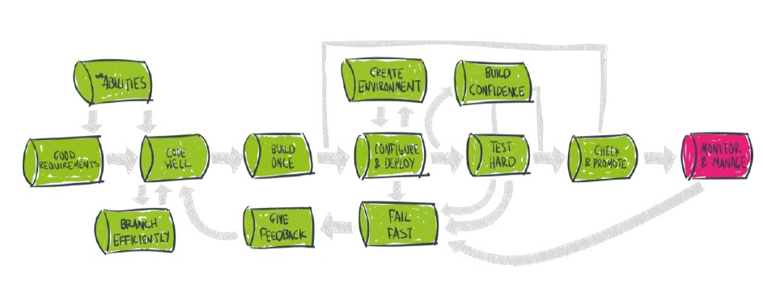

<!-- backgroundColor: white -->
<!--
theme: gaia
paginate: true
-->
<style>
img[alt~="center"] {
  display: block;
  margin: 0 auto;
}
</style>
## Software Development in Cloud Environments
#### Workshop ITCS - Union Investment
Frankfurt, 03.12.2021 - Sven Schürmann & Carina Esau

#

1. [Welcome](#welcome)
2. [Modern Software Development](#modern)
3. [Containerization](#container)
4. [CI/CD](#cicd)
5. [Wrap Up](#wrapup)

---


# Welcome


---


# Modern Software Development


- Entwicklungsumgebungen in der Cloud verhindern zeitaufwändige Konfigurationen

- Ablösung von Monolithen durch Microservices verbessern die Robustheit

- Hoher Grad an Automatisierung steigert die Effizienz (CI / CD)

- API first Strategie unterstützen einen einfachen Datenaustausch

- Container erlauben Flexibilität und Skalierbarkeit


---

# Hands on: FastApi

Use Cases:

- Frage Daten des DAX / SP500 zu einem bestimmten Datum ab (GET)
- Lade neue Daten aus einer .csv Datei hoch (POST)


``` python
import uvicorn
from fastapi import FastAPI, HTTPException, File, UploadFile
from typing import Optional, List
from csv import reader


### gloabls
port = 8000
app = FastAPI()
indices = []


@app.get("/getdata/{date}") # access https://../getdata/..
async def read_item(date: str, index: str = "DAX", show_all_indices: Optional[bool] = False):
  result = {"date": date}

  if date not in fake_items_db:
        raise HTTPException(status_code=404, detail="Date not found")

  elif show_all_indices:
    for i in indices:
      result.update({i: fake_items_db[date][i]})

  else:
    result.update({index: fake_items_db[date][index]})

  return result


@app.post("/uploadfile/")
async def create_upload_files(file: UploadFile = File(...)):
  content = await file.read()

  # add the entries of the uploaded file to fake_items_db
  # data structure of fake_items_db:
  # {"09091990": {"DAX": "1232456", "SP500:" "9238748"}, "08081990":{"DAX": "2345646", "SP500:" "2324432"}, ..}


def add_entries_to_dict(data):
  """
  Adds the entries to the global fake_items_db dictionairy.
  Only available during server runtime.

  Args:
      data (list(list)): [["Date", "DAX", "SP500"], ["30112021", "132345", "762190"], ..]
  """
  for line_no, line in enumerate(data, 0):
    if (line_no == 0):
      new_indices = line[1:]
      for index in new_indices:
        indices.append(index) if index not in indices else indices
    else:
      fake_items_db.update({line[0]: {}})
      for index_no, index in enumerate(indices, 1):
        fake_items_db[line[0]].update({index: line[index_no + 0]})


def initialize_dict(fake_items_db, filename):
  """
  Initializes the fake_items_db dictionairy

  Args:
      fake_items_db (dict): initial empty dictionairy
      filename (string): path to inital file

  Returns:
      dict(dict): {"09091990": {"DAX": "1232456", "SP500:" "9238748"}, "08081990":{"DAX": "2345646", "SP500:" "2324432"} ..}
  """
  file = open('./' + filename, encoding='UTF8')
  csv_reader = reader(file)
  add_entries_to_dict(csv_reader)
  file.close()

  return fake_items_db


fake_items_db = dict()
fake_items_db = initialize_dict(fake_items_db=fake_items_db, filename="daxsp.csv")

if __name__ == "__main__":
    uvicorn.run("main:app", host="0.0.0.0", port=port, reload=False)


```

[Dokumentation zu FastApi Bibliothek](https://fastapi.tiangolo.com/tutorial/request-files/)

---
Serverstart für das Testen der Funktionalität
``` python
# starting pipenv
pipenv shell

# starting uvicorn server
uvicorn main:app --reload

pip3 uninstall python-multipart
pip3 install python-multipart

uvicorn main:app --reload
```

Erreichbarkeit über 127.0.0.1:8000 im Browser
User Interface über 127.0.0.1:8000/docs

---
# Containerization

---
# Exkurs
### Software Deployment + Release



---

# Exkurs
### Software Deployment + Release


---

# Was wäre wenn..

- Wir einfach die Ausführungsumgebung dem Ops Team ebenfalls mitliefern?
- Mit genau dieser Frage beschäftigte sich Docker 2013 primär
- Daraus ergab sich das Konzept eine Appliaktion in einem Container zu verpacken

---

# Ein Container Image erstellen

- Ein guter Anfang ist die Erstellung eines Dockerfile
- Eine Textdatei, die als Skript zum Erstellen eines Images dient
- Erstellen wird es mit dem Befehl `docker build`



---

# Images teilen

- Nach der Erstellung ist das Image nur lokal verfügbar.
- Um es freizugeben, pushen Sie es mit Docker Push in eine Registry
- Docker Hub ist die Standard-Registry
- Viele andere Angebote von Drittanbietern sind ebenfalls verfügbar
- Sobald es freigegeben ist, können andere das Image abrufen

---

# Was ist ein Container

- Ein Container sieht zwar aus wie eine VM, ist es aber nicht!
- Ein Container ist nur ein weiterer Prozess auf dem Rechner
- Er verwendet Namespaces und Kontrollgruppen (cgroups), um eine
Isolierung
- Zu den Namensräumen gehören Netzwerk, Prozess, Benutzer, IPC, Mount und andere.
- Um einen Container zu starten, verwenden Sie den Befehl `docker container run`

---

# Container vs VM



---
# Hands on: Container

``` bash
# building the image
docker build -f ./Dockerfile -t fastapi:1.0

# running the container
docker run -p 8000:8000 -t fastapi:1.0

```

---

# Contionous Delivery
---
# Exkurs: DevOps Model
- Bevor wir uns dem Thema widmen, müssen wir es einordnen


- Der Mensch ist wichtig und nicht die Technologie!
---
# Contionous Delivery



---
# Contionous Delivery - 8 principles

1. The process for releasing/deploying software MUST be repeatable
and reliable
2. Automate everything!
3. If somethings difficult or painful, do it more often
4. Keep everything in source control
5. Done means “released”
6. Build quality in!
7. Everybody has responsibility for the release process
8. Improve continuously

---
# Contionous Delivery - 4 practices

1. Build binaries only once
2. Use precisely the same mechanism to deploy to every environment
3. Smoke test your deployment
4. If anything fails, stop the line!

---
# Demo: Deployment via GitHub Actions

``` bash
name: Build and deploy ITCS API

on:
  push:
    branches:
      - main

jobs:
  build-and-deploy:
    runs-on: ubuntu-latest

    steps:

    - name: Checkout GitHub Actions
      uses: actions/checkout@main


    - name: Login via Azure CLI
      uses: azure/login@v1
      with:
        creds: ${{ secrets.AZURE_CREDENTIALS_ITCS }}


    - name: Login to Container Registry
      uses: azure/docker-login@v1
      with:
        login-server: registry.apps.union-investment.de
        username: ${{ secrets.REGISTRY_USERNAME }}
        password: ${{ secrets.REGISTRY_PASSWORD }}


    - name: Build and push container image to registry
      run: |
        docker build ./src/ -t registry.apps.union-investment.de/itcs/fastapi:${{ github.sha }}
        docker push registry.apps.union-investment.de/itcs/fastapi:${{ github.sha }}


    - name: Deploy to App Service
      uses: azure/webapps-deploy@v2
      with:
        app-name: 'appsvc-itcs-fastapi'
        images: 'registry.apps.union-investment.de/itcs/fastapi:${{ github.sha }}'


    - name: Azure logout
      run: |
        az logout

```
---

# Wrap Up


----

# Thanks for taking part in the workshop!
## We'd like to welcome you on our virtual area at ITCS. Feel free to have a chat with us!
