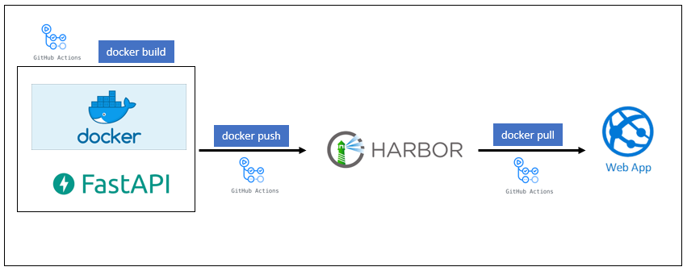

<!-- backgroundColor: white -->
<!--
theme: gaia
paginate: false
-->

## Software Development in Cloud Environments
#### Workshop ITCS - Union Investment
Frankfurt, 03.12.2021 - Sven Schürmann & Carina Esau

#

1. [Welcome](#welcome)
2. [Modern Software Development](#modern)
3. [Containerization](#container)
4. [CI/CD](#cicd)
5. [Wrap Up](#wrapup)

---


# Welcome




---


# Modern Software Development


- Entwicklungsumgebungen in der Cloud verhindern zeitaufwändige Konfigurationen

- Ablösung von Monolithen durch Microservices

- Container erlauben Flexibilität und Skalierbarkeit

- Hoher Grad an Automatisierung (CI / CD)

- API first


---

# Hands on: FastApi

``` python
from fastapi import FastAPI

app = FastAPI()


@app.get("/")
async def root():
    return {"message": "Hello World"}

```

[Dokumentation zu FastApi Bibliothek](https://fastapi.tiangolo.com/tutorial/request-files/)

---
Serverstart für das Testen der Funktionalität
``` python
# starting pipenv
pipenv shell

# starting uvicorn server
uvicorn main:app --reload

pip3 uninstall python-multipart
pip3 install python-multipart

uvicorn main:app --reload
```

---
# Containerization

---

# Hands on: Container

``` bash
# building the image
docker build -f ./Dockerfile -t fastapi:1.0

# running the container
docker run -p 8000:8000 -t fastapi-cd:1.0

```

---

# CI/CD
---
# Demo: Deployment via GitHub Actions

``` bash
name: Build and deploy ITCS API

on:
  push:
    branches:
      - main

jobs:
  build-and-deploy:
    runs-on: ubuntu-latest

    steps:

    - name: Checkout GitHub Actions
      uses: actions/checkout@main


    - name: Login via Azure CLI
      uses: azure/login@v1
      with:
        creds: ${{ secrets.AZURE_CREDENTIALS_ITCS }}


    - name: Login to Container Registry
      uses: azure/docker-login@v1
      with:
        login-server: registry.apps.union-investment.de
        username: ${{ secrets.REGISTRY_USERNAME }}
        password: ${{ secrets.REGISTRY_PASSWORD }}


    - name: Build and push container image to registry
      run: |
        docker build ./src/ -t registry.apps.union-investment.de/itcs/fastapi:${{ github.sha }}
        docker push registry.apps.union-investment.de/itcs/fastapi:${{ github.sha }}


    - name: Deploy to App Service
      uses: azure/webapps-deploy@v2
      with:
        app-name: 'appsvc-itcs-fastapi'
        images: 'registry.apps.union-investment.de/itcs/fastapi:${{ github.sha }}'


    - name: Azure logout
      run: |
        az logout

```
---

# Wrap Up


----

# Thanks for taking part in the workshop!
## We'd like to welcome you on our virtual area at ITCS. Feel free to have a chat with us!
